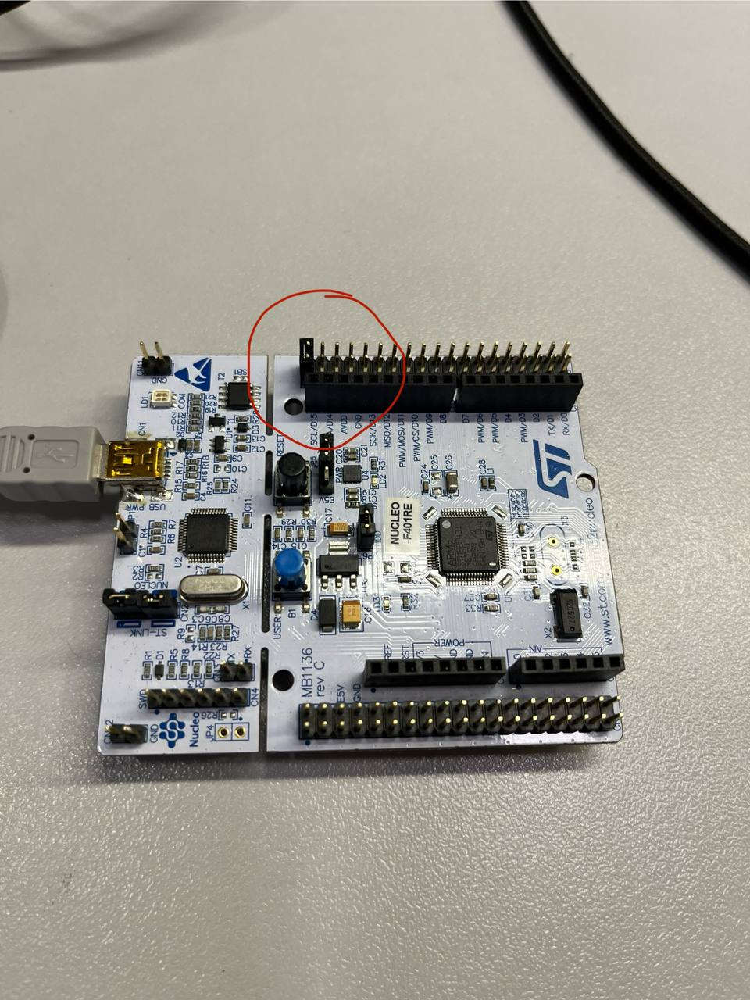

# HardPy stand sample

This is an example of using [HardPy](https://github.com/everypinio/hardpy) to create a functional test bench.

> Note 1. These instructions describe how to use HardPy in Linux.
> If you want to use it in Windows, change the commands to Windows style.

> Note 2. To use this example, you will need python 3.10 or higher and docker to run CouchDB 3.2 or higher.

## Repository structure

1. `tests`: test bench using HardPy .
1. `database`: config for database deployment.
1. `dut_fw`: DUT firmware source code.
Can be modified if desired.
The assembled firmware is in tests directory.

## Stand preparation

1. Clone repository.
1. Install `python` environment:
    ```bash
    $ python -m venv env
    $ source env/bin/activate
    $ pip install -r tests/requirements.txt
    ```

    or, if you prefer conda, install the conda environment:

    ```bash
    $ conda env create -f conda.yaml
    $ conda activate hardpy-sample
    ```
1. Install `pyocd` in the current environment:
    ```bash
    $ pyocd pack update
    $ pyocd pack install stm32f401retx
    ```

## Run CouchDB

1. Run database from `tests` folder:

    ```bash
    $ docker run --name couchdb -p 5984:5984 -e COUCHDB_USER=dev -e COUCHDB_PASSWORD=dev -v ./couchdb.ini:/opt/couchdb/etc/local.ini couchdb:3.3
    ```

    or run docker compose:

    ```bash
    $ docker compose up -d
    ```
2. The database is available at http://127.0.0.1:5984/_utils
Login/password: `dev`

## Run HardPy operator panel

Run `hardpy run tests` and check browser:

http://localhost:8000/

## Stand description

The Nucleo F401RE devboard is used as the DUT.

> Note 3. The address of the DUT is specified in the `conftest.py` file and by default it is `/dev/ttyACM0`.
> If the DUT to be connected is detected at a different address, change it.

Tests:

- Checking the availability of firmware for the board;
- Flashing the devboard;
- Read serial number;
- Check if there is a jumper on the pins (see photo below).
If the jumper is present, the LED flashes, the test passes.
If there is no jumper, the test fails;
- Read the number of clicks on the User Button and display it in the operator panel interface;

<br>
